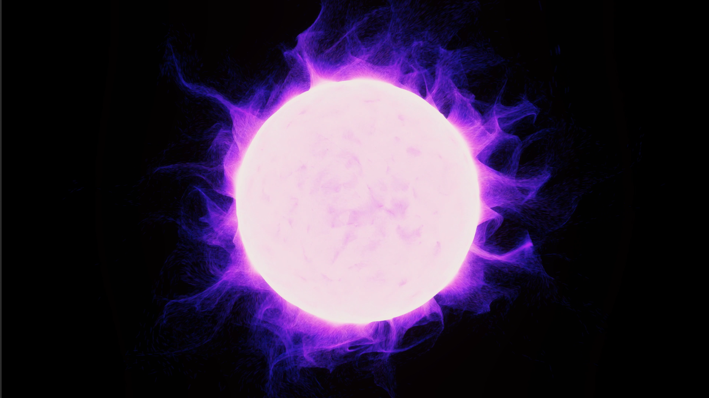
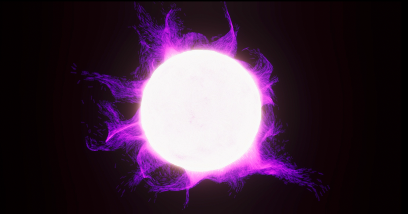
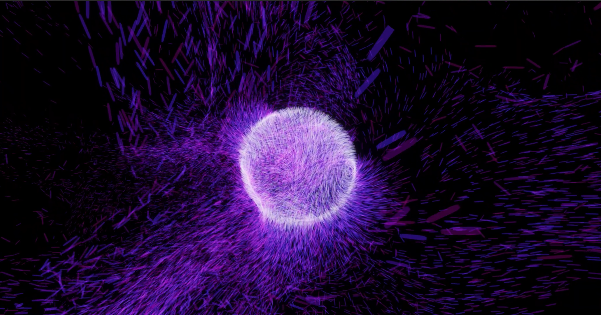

# Unity VFX Particle System Test on MacOS with 1000000 particles
 

- Number of particles: 1000000 
- Unity 2021.1.5f1
- Visual Effect Graph 11.0.0
- High Definition RP 11.0.0
- Unity Recorder 2.5.5
- MacOS 10.15.7
- GPU: AMD Radeon Pro 5600M

10 million particles - Render

1 million particles - Screen Recording

20000 particles - Screen Recording

